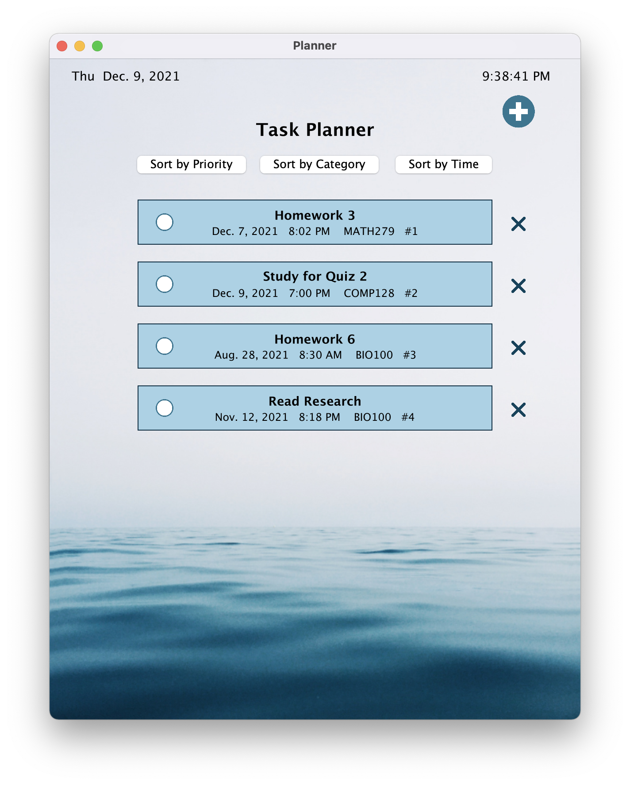
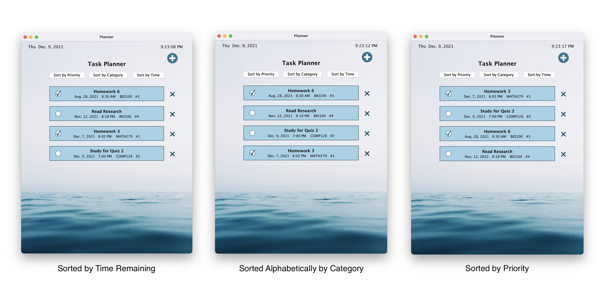
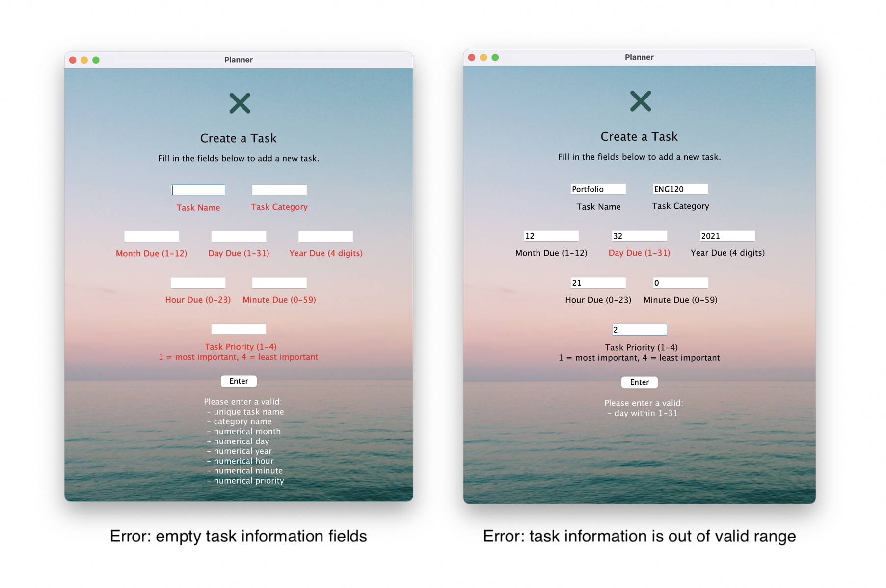
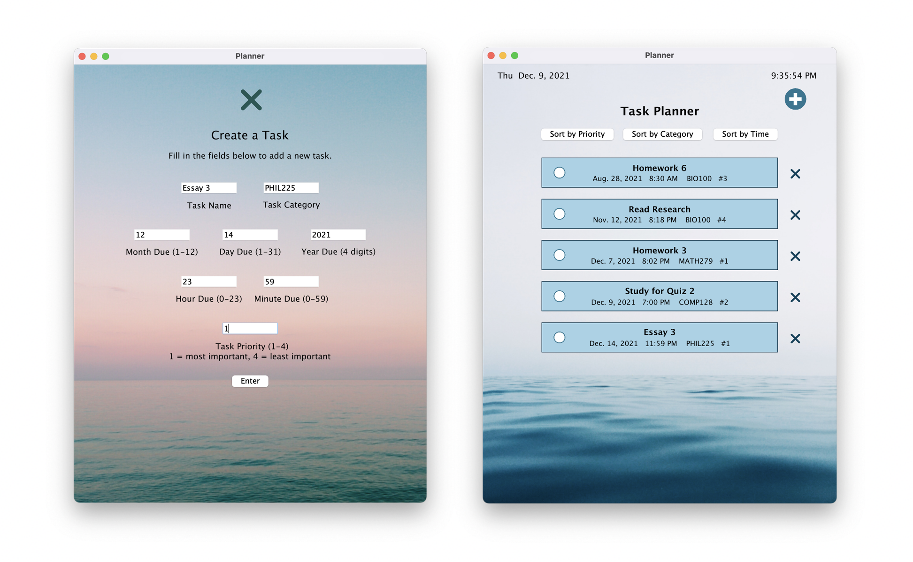

# Task Planner

For our final project, we created a Planner App that allows for a user to keep track of various tasks and assignments. Tasks on the Planner contain important information such as the due date and deadline time, as well as a custom user category and user-set priority on a scale of 1-4 (1= most important, 4 = least important). The user can add all their tasks to the planner and they will be displays by the user choice of priority type.

## Rationale

The purpose of this project was to build a tool that can help the user save and sort their tasks and assignments in an easier manner. It is easier to add and keep track of tasks with this app as the user won't need to sort out the timing of their tasks and assignments by themselves. Also they can add more tasks at any time and have them automatically sorted in various orders. Moreover, The user gets a chance to sort their data by a different kind of priorities at any time, eficiently.

## User Interface and Sorting

In addition to the tasks, the main Planner interface displays a live clock with the current time and date, the planner title, an add button, as well as checkboxes and remove buttons for each task. One key feature of the Planner app is that it allows for users to sort tasks according to deadline (nearest deadline appears first), alphabetical category, and priority. When users click on any of the three sort buttons located at the top of the window, the tasks are updated and display by the new given priority.

## User Interaction

Users can interact with the Planner App in diferent ways: 
By clicking on a task's checkbox to indicate that the task has been deleted,
Clicking the x-shaped remove button next to the task to remove it from the Planner app, 
Clicking on a checkbox next to the task to show the tast is completed , 
Clicking the round plus-shaped add button at the upper right corner of the window to add a new task. 

When the user clicks on the add button, an Add Menu is launched. The Add Menu allows for users to create new tasks with names, deadlines, due dates, categories, and priority ranking. If a user attempts to create a new task with missing information, the program displays an error message as seen below on the image to the right. Similarly, if a user attempts to create a new task with information that is invalid (e.g. by inputting a month greater than 12, a minute greater than 59), the program displays a unique error message that indicates which value is invalid. 

If all of the user's inputted information is valid and the name of the task is unique, the task is added to the main task interface where the task can be viewed and sorted alongside existing tasks.

## Class Decomposition

1. **PlannerApp.java** initializes the app window, has an Add Menu, list of Task objects, Task GUI object, 3 priority queues, 3 comparators
2. **AddMenu.java** initializes the Add Menu that contains text fields for users to input new task information, quit button to terminate Add Menu, and enter button to check information and add new tasks
3. **Checkbox.java** creates checkbox objects that can be checked or unchecked
4. **Task.java** creates Task objects that has information such as task name, category, due date, due time, 
5. **TaskGUI.java** creates Graphics objects on a canvas window to represent every task sorted according to one of the three priority queues, has a checkbox for each task
6. **CategoryComparator.java**  sorts Task objects alphabetically according to category, if tasks have the same category, sorts tasks by deadline/due time
7. **PriorityComparator.java** sorts Task objects according to the user assigned priority label, if tasks have the same priority, sorts tasks by deadline/due time 
8. **TimeComparator.java** sorts tasks by deadline/due time

## Data Structures Used

### Lists

We used ArrayLists to hold the tasks in the main Planner App, as well as the checkbox and task name GUI objects. This is because we wanted a data type that had an efficient get method that runs in O(1) constant time and allowed to us use indexing. Indexing was important in order to access GUI items that belonged to the same task.

### Priority Queue

We created three different comparators and three different priority queues to implement the sorting feature in the main Planner App user interface. Each comparator sorts task objects in different orders: alphabetically by category, time remaining until due, and user-specified priority level. The GUI takes a priority queue and displays task according to the order of the queue.

### Maps

We used a map to keep track of which checkboxes are checked and unchecked so that when a user changes the sort view of the Planner, the tasks that they checked remain checked. Our map has the name of the task as keys and a boolean (checked = true, unchecked = false). 

## Future Improvements
- We can adding a scroll function can make the app more user friendly.
- A reminder system can make the app more helpfull by riminding the user of the tasks even when the app is closed.
- An export to calendar function can be helpfull as it allows the user to easilu export the data to their personal calender. 
- Making the App more user friendly by adding theme and backgroud personalization options change planner theme/background.

